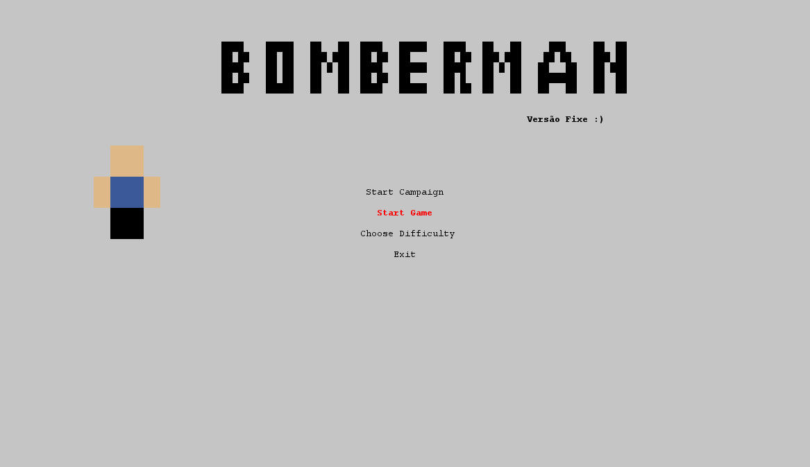
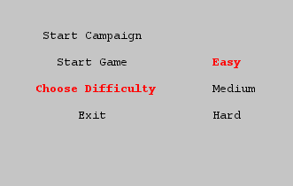
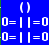
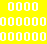
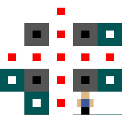
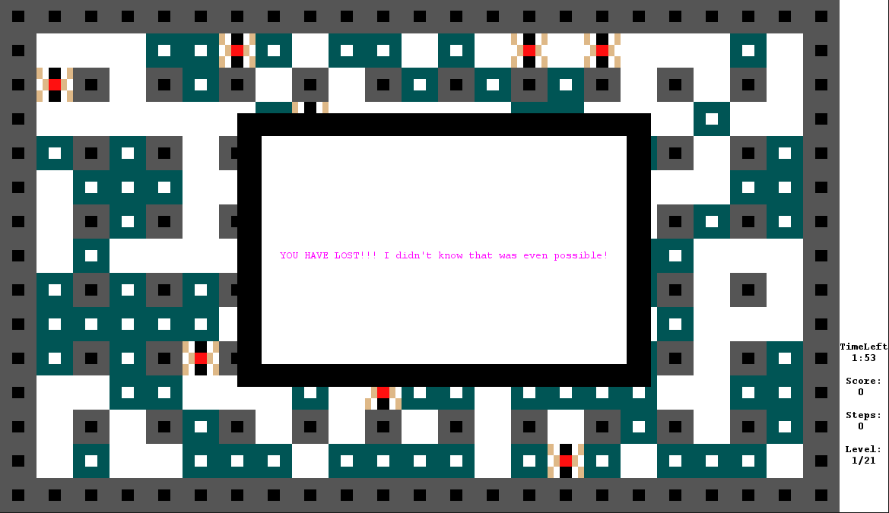
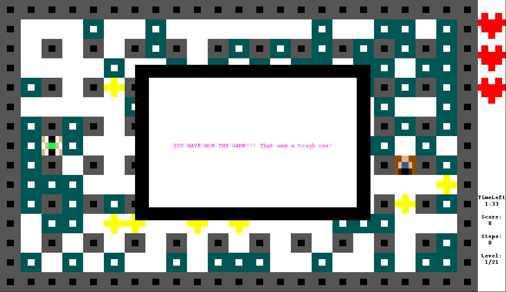

<table style="width:50%;">
  <tr>
    <th><a href="https://github.com/rocas777"><b>Miguel Pinto</b></a></th>
    <th><a href="https://github.com/NunationFL"><b>Nuno Oliveira</b></a></th>
  </tr>
</table>

# LPOO_T81 - BOMBERMAN COOL VERSION

>Bomberman is a strategic, maze-based video game franchise in which the player holds an unlimited number of bombs and uses them to open his path on the maze and find the door that will lead to the next level, all this while evading bad monsters :(
>
>Our version aims to replicate the original game to some extent. This means the concept will be the same, however, unlike most iterations of the game, the player does not lose after being caught on an explosion, it just loses a life. The player will start out with 3 lives which he will lose by exploding himself or getting in contact with the monsters. There are also various drops from exploded blocks, some will add time, lives, score and even turn the hero into the Hulk for 10 steps.
>
>This project was developted by Nuno Oliveira (up201806525@fe.up.pt) and Miguel Pinto (up201806206@fe.up.pt) for LPOO 2019/2020.
>
> Small trailer (colors aren't really accurate because of format):
>
>
## Implemented Features

### Menu
> The initial the menu (to be navigated using 'w', 'a' and 'ENTER') the player will see after running the game :
>
>
>
> A sub menu to choose difficulties:
>
>

### Gamemodes
> - Start Campaign - If the campaign mode is chosen, the player will need to defeat 21 levels in order to win the game. Each level will only differ in the amount and type of monster the hero will have to face, besides the random placement of the collectibles and destructible blocks. After completing each level a 'winning screen' will be shown and the player must press 'q' to go back to the menu and continue with the following level. The levels are read from a text file stored in the resources folder. It goes from 1 Easy Monster on the 1º level to 8 Hard Monsters in the 21º level.
>
> - Start Game - This mode will serve as a kind of practice. It will only consist of 1 level with 6, 7 or 8 monster of easy, medium or hard difficulty respectively and those are pretty much the only differences compared to the campaign.

### Saving
> While doing campaign if the player closes the game the score and level are saved to a file 'currentlevel.lvl' on the root folder. Next time the campaign starts it will go on from where the player left off.

### Monster
>The ones we are supposed to run way
   

### Hero
>The Hero is the one controlled by the player

### Blocks
>The blocks that can be exploded
 
>
>The blocks that can´t be exploded

### Collectibles
>Everytime you destroy a block it can drop any of the following items:
>
>The target Tile, The door to Victory (only 1 per level)
>
>
>Increases the score by 1 point

>
>Adds 15 seconds to the remaining time

>
>Gives you one more life (max 5)

>
>Sets hero in a powerfull state where he can destroy blocks and kill monster just by walking to them for 10 steps (Hulk Mode)

>
> #### Note: Obviously the drop rates were adjusted for each item for the sake of balance

### Score
> The score has no real practical purpose, it is just there for competitive value. Everytime you pick up a coin it will increase by one and while you are doing the campaign it will carry over to each new level (it won't reset to 0).

### Lives
> These evidently are very important since if the player were to 'lose', instead he will just lose a life. Also, everytime the hero picks up a life (from a drop) it will only increase the effective number of lives up to 5, so if you already have 5, your best bet would be to let the drop be and pick it up later if you need.

### Time
> For every level the player will only have 2 minutes to win. Getting time drops will increase the total time by 15 seconds and there's no upper threshold. If the timer reaches 0 the will hero will fail that level, but he can always try again.

### States
> Everytime the player loses a life he will enter a state of invulnerability for 1,6 seconds so that he has time to run from monsters and think about his poor life choices :D. While this, the player's colors will tick so you can easily tell when it ends.
>
> There's also another state that the player enters after picking it up that we previously described as 'turning into Hulk'. After entering this state, for the next 10 steps the player can destroy monsters and blocks(removable ones only) just by walking to them. Similar to the above metioned state, the player's colors will change and the number of steps left will also be decremented on the right Panel.

### Movement and collision detection
>The player moves according to keyboard input (A-left; S-down; D-right; W-up).
>
>The monster's movement will differ according to the difficulty they are assigned (explained in more detail further down on the difficulty part).
>
>There's also collision detection. For players if there is an input that will force the character into a wall it simply won't happen. As for the monsters, if it would happen they'll just choose another position if able.

### Bomb deployment and explosion
>The player can press 'p' to deploy a bomb. The bomb will not explode for the first second so that the player has time to get to a safe spot. After the safety time expires the bomb will explode horizontally and vertically in a range of 2 for each side and destroy whatever it can (player, monsters, destructible blocks). For 250ms the bomb will leave a fire trail that will kill monsters and remove a life from the player.
>
>
>
> If the player is caught up in the explosion he will lose a life.

### Difficulty
> There are 3 distinct difficulties. Each one only changes the way a monster moves. This way difficulties aren't associated with a specific level (being that they are all fundamentally the same) but instead they are an attribute of each monster.
> - Easy - The next tile the monster will move to is calculated at random
> - Medium - The monster will move to the tile closest to the hero
> - Hard - Similar to Medium, the monster will chase the player, but on this difficulty it will avoid bombs
>
> Pro tip: there's a really simple but hard way (hence the name) to defeat a hard monster. You just need to lure them into a place they cannot escape when you deploy a bomb. Good luck :)
>
> Small note: Because the Easy monster's movement is random, sometimes it is in a tile next to the player but won't move in his direction so he won't loose a life. 
### Map Design
>Each new playthrough the map generated will have all indestructible block in the same place, basically the same fundamental structure. Contrary to that, the destructible ones will be placed at random and so will the monsters and drops.
>
>The player will always start on the top left
>
>There's also a white sidebar that contains a number of hearts equal to the number of lives the hero has, the time remaining, the level you will be playing and the number of steps left on the powered-up state.
>
>

### Lose condition
> If the player were to reach 0 lives he will lose. If you're doing the campaign the level will not be reset to 0, you can just try again.
>
>
### Win Condition
> The door will be hidden underneath one destructible block at random. If the player founds it after destroying the respective block he will suceed on completing the level.
>
>
