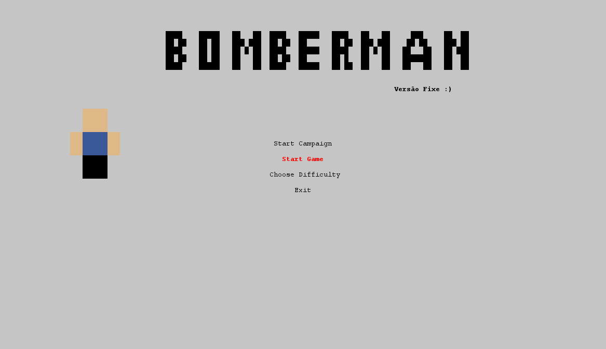
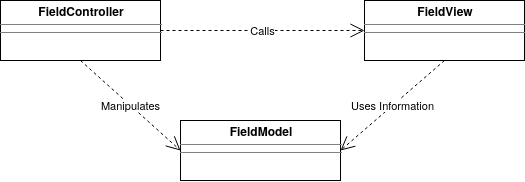
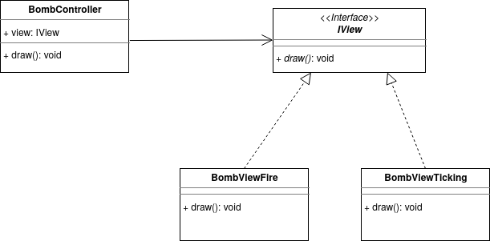
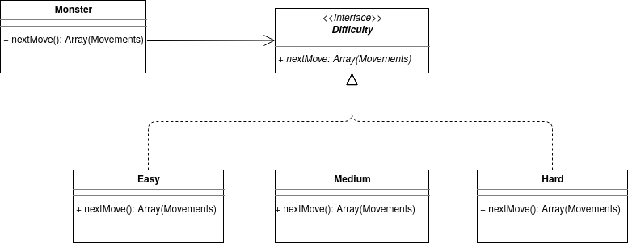
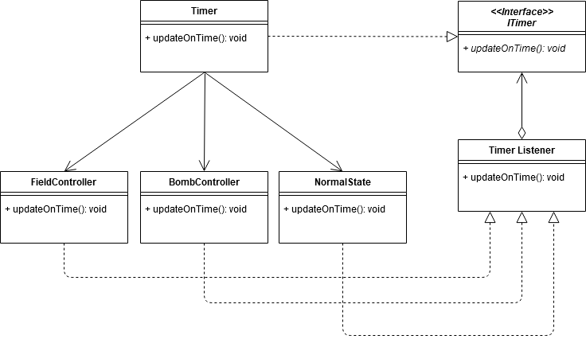
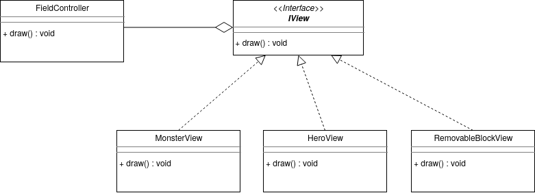
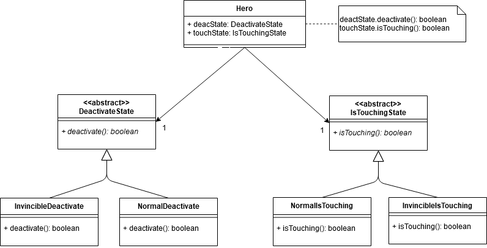
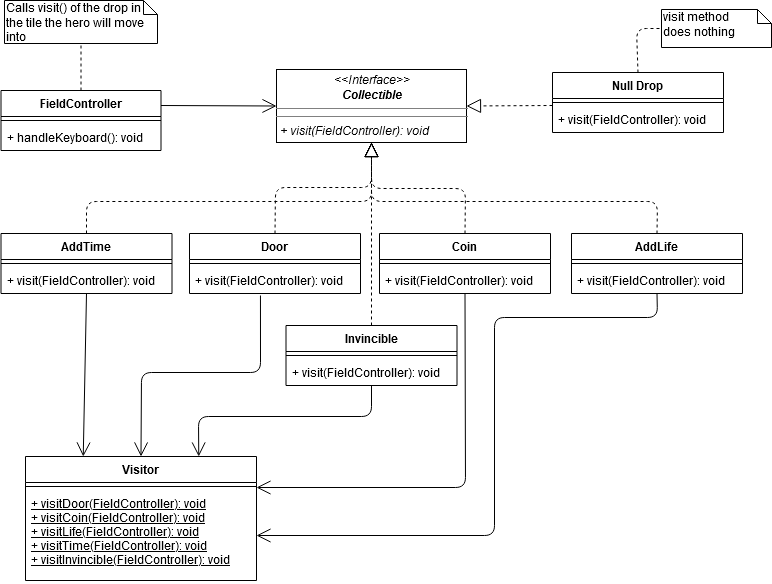
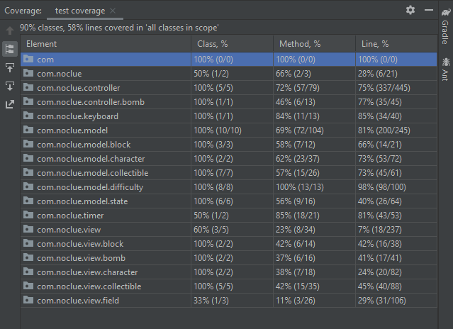
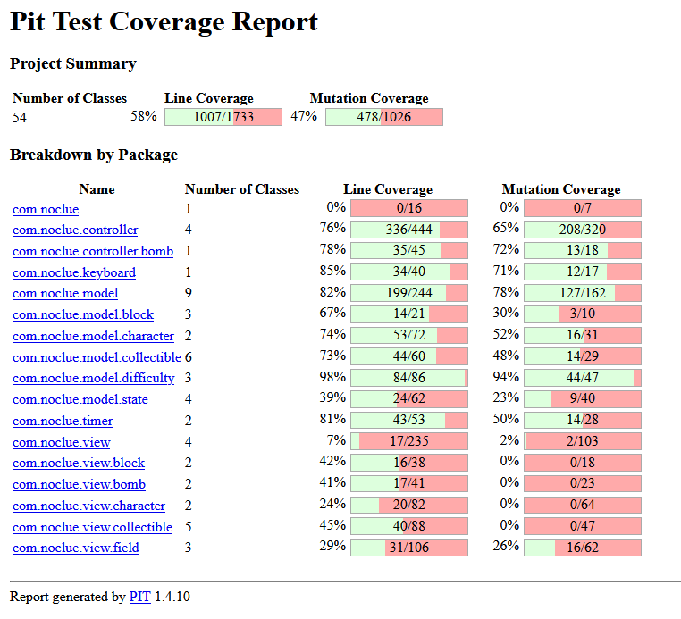

# LPOO_T81 - BOMBERMAN COOL VERSION

>Bomberman is a strategic, maze-based video game franchise in which the player holds an unlimited number of bombs and uses them to open his path on the maze and find the door that will lead to the next level, all this while evading bad monsters :(
>
>Our version aims to replicate the original game to some extent. This means the concept will be the same but with unlike most iterations of the game, if the players would be caught up in his bomb's explosion he would lose a life. That leads to another difference: lives. The player will have 3 lives which he will lose by exploding himself or getting in contact with the mosnters. There are also various drops from exploded blocks that will add time, lives, score and even turn the hero into Hulk for 10 steps.
>
>This project was developted by Nuno Oliveira (up201806525@fe.up.pt) and Luis Pinto (up201806206@fe.up.pt) for LPOO 2019/2020.

## Implemented Features

### Menu
> The initial the menu the player will see after running the game to be navigated using 'w', 'a' and 'ENTER':
>
>
>
> A sub menu to choose difficulties:
>
>

### Gamemodes
> - Start Campaign - If the campaign mode is chosen the player will need to defeat 21 levels in order to win it. Each level will only differ in the amount and type of monster the hero will have to face besides the random placement of the collectibles and destructible blocks. After completing each level a 'winning screen' will be shown and the player must press 'q' to go back to the menu and continue with the following level.
>
> - Start Game - This mode will serve as a kind of practice. It will only consist of 1 level with 6, 7 or 8 monster of easy, medium or hard difficulty respectively and those are pretty much the only differences compared to the campaign.

### Monster
>The ones we are supposed to run way
   

### Hero
>The Hero is the one controlled by the player

### Blocks
>The blocks that can be exploded
 
>
>The blocks that can´t be exploded

### Collectibles
>Everytime you destroy a block it can drop any of the following items:
>
>The target Tile, The door to Victory 
>
>
>Increases the score by 1 point

>
>Adds 15 seconds to the remaining time

>
>Gives you one more life (max 5)

>
>Sets hero in a powerfull state where he can destroy blocks and kill monster just by walking to them for 10 steps

>
>Obviously the drop rates aren't the same for all of them for the sake of balance

### Score
> The score has no real purpose to be fully honest, it is just there for competitive value if you will. Everytime you pick up a coin it will increase by one and while you are doing a campaign it will carry over to each new level (it won't reset to 0).

### Lives
> These obviously are very important since if the player were to 'loose', instead he will just loose a life. Also, everytime the hero picks up a life (from a drop) it will only increase the effective number of lives up to 5, so if you already have 5 your best bet would be to let the drop be and pick it up later if you need.

### Time
> For every level the player will only have 2 minutes to win. Catching time drops will increase time remaining by 15 seconds and there's no upper threshold. If the timer reaches 0 the will hero will fail that level, but he can always try again.

### States
> Everytime the player looses a life he will enter a state of invulnerability for 1,6 seconds so that he has time reposition and think about his poor life choices :D. While this is going on the player's colors will tick so you can easily tell when it ends.
>
> There's also another state that the player enters after picking it up that we previously described as 'turning into Hulk'. While on this state for the next 10 steps the player can destroy monsters and blocks just by walking into them. Similar to the above state it is to tell if it is on or not due to the player's ticking colors and the fact that the number of steps remaining are tracked on the sidebar.

### Movement and collision detection
>The player moves according to keyboard input (A-left; S-down; D-right; W-up).
>
>The monster's movement will differ according to the difficulty they are assigned (explained in more detail further down on the difficulty part).
>
>There's also collision detection. For players if there is an input that will force the character into a wall it simply won't happen. As for the monsters, if it would happen they'll just choose another position if able.

### Bomb deployment and explosion
>The player can press 'p' to deploy a bomb. The bomb will not explode for the first second so that the player has time to get to safety. After the safety time expires the bomb will explode horizontally and vertically in a range of 2 for each side and destroy whatever it can (player, monsters, destructible blocks).
>
>
>
> If the player is caught up in the explosion he will lose a life.

### Difficulty
> There are 3 distinct difficulties. Each one only changes the way the monster moves. This way a difficulty isn't associated with a specific level (being that they are all fundamentally the same) but instead it is associated to a monster.
> - Easy - The next tile the monster will move to is calculated at random
> - Medium - The monster will move to the tile closest to the hero
> - Hard - Similar to Medium the monster will chase the player but on this difficulty it will avoid bombs
>
> Pro tip: there's a really simple but hard way (hence the name) to defeat a hard monster. You just need to lure them into a place they cannot escape when you deploy a bomb. Good luck :)
>
> Small note: Because the Easy monster's movement is random, sometimes it is in a tile next to the player but won't move in that direction so he won't loose a life. 
### Map Design
>Each new playthrough the map generated will have all indestructible block in the same place, basically the same fundamental structure. Contrary to that, the destructible ones will be placed at random and so will the monster.
>
>The player will always start on the top left
>
>There's also a white sidebar that cointains a number of hearts equal to the number of lives the hero has, the time remaining, the level you will be playing and the number of steps left on the powered-up state.
>
>

### Lose condition
> If the player were to reach 0 lives he will lose. If you're doing the campaign the level will not be reset to 0, you can just try again.
>
>
### Win Condition
> The door will be hidden underneath one destructible block at random. If the player founds it after destroying the respective block he will suceed on completing the level.
>
>

## Design

### 1. Code Architecture
#### The Problem
>On the very first class when we started to plan out the code, one of the main debates we had was on how to structure the code. Initially we just made different classes that would do everything related to them and put them into packages according to their category (for example: we had a class "Monster" that would manipulate and draw itself). It did work, but it wasn't very clean, could be hard to read for other people and this way of coding clearly violates the Single Responsibility Principle.
#### The Design
>In order to solve this issue and separate responsibilities into different objects we adopted the MVC (Model - View - Controller) pattern. Doing so allowed us to make our code organized, easier to read and overall structured. We also benefict from the fact that changing or adding features is very much simpler. Since we only thought of implementing this design midway it took longer than expected but this is how it turned out...
#### The Implementation
>The following UML shows how we implemented this design through one example since it is basically the same for every object:
>
>
>
>These classes can be found at:
>
> [FieldController](../src/main/java/com/noclue/controller/FieldController.java)
>
> [FieldView](../src/main/java/com/noclue/view/field/FieldView.java)
>
> [FieldModel](../src/main/java/com/noclue/model/FieldModel.java)
#### The Consequences
> - Following some advantages already stated on "The Design" part like facilitating the change of one component alone the MVC will make simultaneous development easier since each component is technically independent. Another bonus we came across at a chance is the fact that a "model" can have multiple views which will be helpful with the bomb (ticking and fire).
> - Now the code not only respects the Single Responsibility Principle (each component has responsibility over a single part of the application) but also, in a way, the Open-Closed Principle because if some feature is added that requires a new class the amount of pre-existing code that needs changing is relatively small.
> - The only downside we think this pattern has is that the framework will become more complex in a way that even if it is more organized it also is much tiring to navigate.

### 2. Bomb Explosion
#### The Problem
>While implementing the bomb functionalities we had to decide on how to do the bomb explosion part. On one hand we could make each bomb responsible for handling its own explosion rendering, on the other hand we could pass that duty to the field controller (in the way we designed the app the field model holds almost every other class). 
#### The Design
>We chose to go with the first option of letting each bomb handle itself and implementing a State Pattern since this was specially easier to do with the above mentioned MVC pattern. What this pattern does is allow us to represent different states of application with different subclasses. This pattern allowed us to address this simple problem because the bomb clearly has two different states: ticking and explosion. When the bomb needs to change from ticking to exploded, it only has to change its view. Since both implement the same interface, the controller does not have the need to keep checking flags and if's when it renders to check the state.  
#### The Implementation
>The following UML shows how we mapped this pattern:
>
>
>
>These classes/interface can be found at:
>
> [BombController](../src/main/java/com/noclue/controller/bomb/BombController.java)
>
> [IView](../src/main/java/com/noclue/IView.java)
>
> [BombViewFire](../src/main/java/com/noclue/view/bomb/BombViewFire.java)
>
> [BombViewTicking](../src/main/java/com/noclue/view/bomb/BombViewTicking.java)
#### The Consequences
> - The state changing is less complicated and doesn't rely on a bunch of different flags
> - It will make adding more states (like an actual ticking animation) undemanding
> - Saves us the trouble of using big if statements

### 3. Difficulties
#### The Problem
>Even though this is a simple project we wanted our game to be enjoyable for both casuals and tryhard gamers (and something in between). In order to achieve this, we chose to make our game have different difficulties. Depending on the difficulty, the monster will behave differently. To achieve this we could just add a bunch of if statements, but that wouldn't be a good pratice and could hurt future development and even performance.
#### The Design
>To work this problem out we chose to use the Strategy Pattern. It solves this specific problem allowing us to define a number of related algorithms and encapsulate them, making them interchangeable and thus changing the monsters's behaviour slightly according to the difficulty that is assigned even though their job is all the same. The Monster only has to call the class that was passed to it, and that class is responsible for sorting the four possible movement by most preferable according to each difficulty's objetive.
#### The Implementation
>The following UML shows how we mapped this pattern:
>
>
>
>These classes/interface can be found at:
>
> [Monster](../src/main/java/com/noclue/model/character/MonsterModel.java)
>
> [Difficulty](../src/main/java/com/noclue/model/difficulty/Difficulty.java)
>
> [Easy](../src/main/java/com/noclue/model/difficulty/Easy.java)
>
> [Medium](../src/main/java/com/noclue/model/difficulty/Medium.java)
>
> [Hard](../src/main/java/com/noclue/model/difficulty/Hard.java)
#### The Consequences
> - Eliminates a lot of complex conditional statements
> - Makes adding and changing difficulties effortless
> - Requires the classes that are influenced by each difficulty to know what it is

### 4. How to update every object
#### The Problem
>In order for the game to feel fluid, the monster have to beindependent from player, contrary to what happened on the hero project where the monsters only moved when the player did so. So we made a timer class that would simultate a clock for both image printing and monster movement;
>The issue was on how to notify each monster to move. There was a different but similar situation with our hero, where he needed to wait for an input that wasn't his to receive. How should we go about this? The hero situation represented an even bigger setback because the keyboard input is asynchronous.
#### The Design
>We rapidly decided to adopt the Observer Pattern for this situation. This design defines a one-to-many dependency between objects so that when one object updates its dependents, they are notified and updated automatically. Applying this to our project, the "status change" would be the instant there's a new frame to draw or when keyboard interrupt is received and both of them have its own "Listener" class that does exactly that, simulate a framerate and listen to keyboard input.
>This way using the concepts of the Observer Pattern, those listeners notify the classes that depend so they can update themselves (TimeListener notifies the FieldController, BombController and NormalState if necessary and KeyboardListener notifies the FieldController and the MenuController. The FieldController has a similiar aproach by notifying the other classes to draw.
#### The Implementation
>The following UML shows the time listener and how the main controllers depend on it (the keyboard listener is basically the same so we decided not to put it in the UML to simplify):
>
>
>
>These classes/interface can be found at:
>
> [Timer](../src/main/java/com/noclue/timer/TimeListener.java)
>
> [ITimer](../src/main/java/com/noclue/timer/Timer.java)
>
> [TimerListener](../src/main/java/com/noclue/timer/TimerInterface.java)
>
> [FieldController](../src/main/java/com/noclue/controller/FieldController.java)
>
> [BombController](../src/main/java/com/noclue/controller/bomb/BombController.java)
>
> [NormalState](../src/main/java/com/noclue/model/state/NormalDeactivate.java)
#### The Consequences
> - Further encapsulation and code structurization where the listeners have no information about their observers, just that they exist and the need to notify them when the time is right, nor do they about the listener.
#### * Note about the class notification: since the FieldModel holds almost every other model it would make sense for the FieldController to also manipulate most of them.

### 5. Simplify draw calls
#### The Problem
>This wasn't a major issue with our code, but some classes had different arguments for their draw calls and in the midst of development we faced some visual bugs due to not noticing we had passed to wrong arguments to the function. We could just correct the small situation and move one but we chose to make it easier for future draw functions and since the mistake happened once it may as well happen twice. 
#### The Design
>The need to adapt the code lead us to the Interface Adapter design. This allows to convert the interface of class into another interface that is expected. Even though we are not following the design to the word since we are not really adapting interfaces (just a simple function) we took some principles off of it and choose tho make a generic draw() call that each class will adapt to its own liking.
#### The Implementation
>The following UML serves as an example of how we achieved this:
>
>
>
>These classes/interface can be found at:
>
> [FieldController](../src/main/java/com/noclue/controller/FieldController.java)
>
> [IView](../src/main/java/com/noclue/IView.java)
>
> [MonsterView](../src/main/java/com/noclue/view/character/MonsterView.java)
>
> [HeroView](../src/main/java/com/noclue/view/character/HeroView.java)
>
> [RemovableBlockView](../src/main/java/com/noclue/view/block/RemovableBlockView.java)
#### The Consequences
> - Code less prone to mistakes
> - More readability
> - The caller does not have to know the class objects and functions parameters 

### 6. Life Handling and Power-Up
#### The Problem
> The implementation of lives was bundled together with a big hurdle. The fact that the player wouldn't lose immediatly wasn't, at first, assured just by removing a life since the monster would just kill the player again real fast and as for the bomb, the tiles where it would explode would continue to 'be exploding' for a while and so the player would mostly lose all his lives instantly anyway.
#### The Design
> To go around this we decided to make the hero have a few seconds of invulnerability after loosing a life so he can reposition and avoid losing all lives in the same instant. The way we chose to do is using the State pattern which allows us to alter the hero's behaviour according to his current state. To be more precise the invulnerability state (used together with a timer so it can be reverted to the normal state) would just do nothing when the other would decrement lives.
>
> Taking advantage of this addition we also implemented a feature where the player could be powered-up for a few steps and although the end result is different, the pattern used is the same altering the 'isTouching' logic.
#### The Implementation
> The following UML shows how we did this:
>
>
>
> These classes can be found at:
>
> [Hero](../src/main/java/com/noclue/model/character/HeroModel.java)
>
> [DeactivateState](../src/main/java/com/noclue/model/state/DeactivateState.java)
>
> [InvincibleDeactivate](../src/main/java/com/noclue/model/state/InvincibleDeactivate.java)
>
> [NormalDeactivate](../src/main/java/com/noclue/model/state/NormalDeactivate.java)
>
> [isTouchingState](../src/main/java/com/noclue/model/state/IsTouchingState.java)
>
> [NormalIsTouching](../src/main/java/com/noclue/model/state/NormalIsTouching.java)
>
> [InvincibleIsTouching](../src/main/java/com/noclue/model/state/InvencibleIsTouching.java)
>
> And the one that handles the calling of deactivate and isTouching is [HeroController](../src/main/java/com/noclue/controller/HeroController.java)

#### The Consequences
> - Adding states is very simple and doesn't require changing the ones that already exist.
> - Single Responsibility principle: each class has only one job
> - No need of using a multitude of conditional statements that would make the code harder to read

### 7. Instanceof
#### The Problem
> After finishing almost all our main objectives for the project, while reviewing our code we noticed the use of multiple 'instaceof' which worked fine but isn't a very good practice and makes the code less extensible.
#### The Design
> Suceeding some research and consulting our professor we decided to use a slightly modified version of the Visitor pattern which consists of creating a new class 'visitor' and placing each different behaviour in a new method. Instead of handling the behaviour directly we would pass all the necessary information to the target object and he in turn would call the approriate method of the 'visitor' since obviously he knows what class he is.
#### The Implementation
> The UML that represents how we implemented this pattern:
>
>
>
>[FieldController](../src/main/java/com/noclue/controller/FieldController.java)
>
>[Collectible](../src/main/java/com/noclue/model/collectible/Collectible.java)
>
>[Time](../src/main/java/com/noclue/model/collectible/AddTime.java)
>
>[Life](../src/main/java/com/noclue/model/collectible/AddLife.java)
>
>[Coin](../src/main/java/com/noclue/model/collectible/CoinModel.java)
>
>[Invincible](../src/main/java/com/noclue/model/collectible/Invencible.java)
>
>[Door](../src/main/java/com/noclue/model/collectible/DoorModel.java)
>
>[Null](../src/main/java/com/noclue/model/collectible/NoCollectibleModel.java)
>
>[Visitor](../src/main/java/com/noclue/model/collectible/Visitor.java)
#### The Consequences
> - Open/Closed Principle: ease of adding new visiting behaviours
> - Single Responsibility Principle: bundle multiple behaviours together
> - Introduces interdependencies

## Known Code Smells and Refactoring
### 1. Lazy/Data classes
#### Smell
>The class [position](../src/main/java/com/noclue/model/Position.java) is a data class since it only consists in some private fields, getters and setter for accessing those fields. It can not operate on its own and its only puporse is to be used by other classes.
#### Refactoring
>We could follow two paths. One is to remove this class as it could be considered disposable. Other path is to add other functionalities to it, other than the CRUD ones.
Removing this class would make other classes more crowded so it might not be the better aproach.
We could make so that this class could handle returning other positions next to it (left, right, up, down),checking if they are inside of the screen, instead of letting the [FieldContoller](src/main/java/com/noclue/controller/FieldController.java) class handle it.
### 2. Tile Class
#### Smell
>This ([Tile](../src/main/java/com/noclue/model/Tile.java)) class can be considered a lazy class since it doesn't do much really. Our main goal developing this class was for it to hold the classes that were in that specific tileModel in each moment and handle conversions between real cli position and game tileModel. We sort-of went with the flow and midway throught the project we noticed it only does half of what it was supossed to do (hold the info about what is in there) and some of its original responsibilities were given to other classes(mainly field).
#### Refactor
>In order to fix this smell we could refactor our code to give it its original functionalities or add others like handling the drawing of what is inside. There's also the alternative of simply deleting this class but we don't think it is the best way to go forward. Right now the field is responsible for reseting the tileModel and copying its information to other tileModel. Those tasks can be given to Tile class, it would turn Tile into a useful class, while removing complexity and adding readability to the field class;  
### 3. Conditionals on view
#### Smell
>We would first like to say that we intended for the FieldModel to contain many other classes that are related to it. In the game, the hero and monsters for example will be inside a field along with other objects so we coded with that same idea in mind. That being said both the FieldModel and FieldController can be considered large classes specially the last one due to a bigger number o methods, fields and overall length.
>The controller could also be regarded as feature envy considering it accesses other classes information a lot even though these are its own fields. There's also the fact that some methods of the controller can be seen as relatively large and difficult to test. 
#### Refactoring
>To fix some of the said problems we could assign more responsibilities to the other classes instead of relying so heavily on the field and to reduce some bigger methods we could refactor it into more different methods but smaller usign the extract method. We could make two different classes, one handles the static elements as blocks, door and coins, and the other handles the monsters and hero. Both could communicate with a class that would aggregate those classes and manage the Tiles.
## Testing
### Screenshot of test coverage

### Screenshot of mutation testing report

>This report can be found [here](report-mutation).
## Notes about warnings
>After compiling there will appear a warning saying that FieldController.java "uses unchecked or unsafe operations". This probably has to do with the casting of variables but since the program works great and we can't pinpoint what gives off the warning we'll just let it be for now.
## Self-Evaluation
>Nuno Oliveira (up201806525@fe.up.pt): 50

>Luis Pinto (up201806206@fe.up.pt): 50
